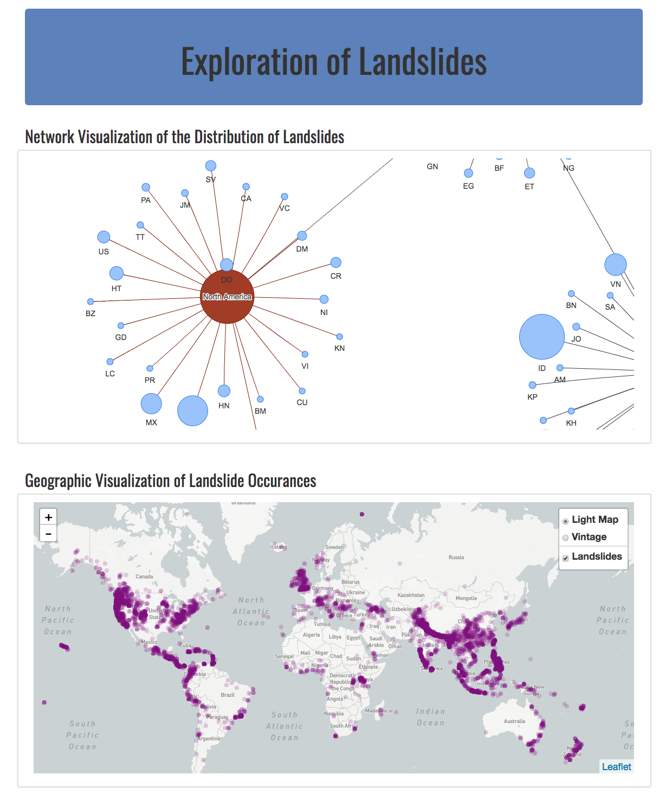
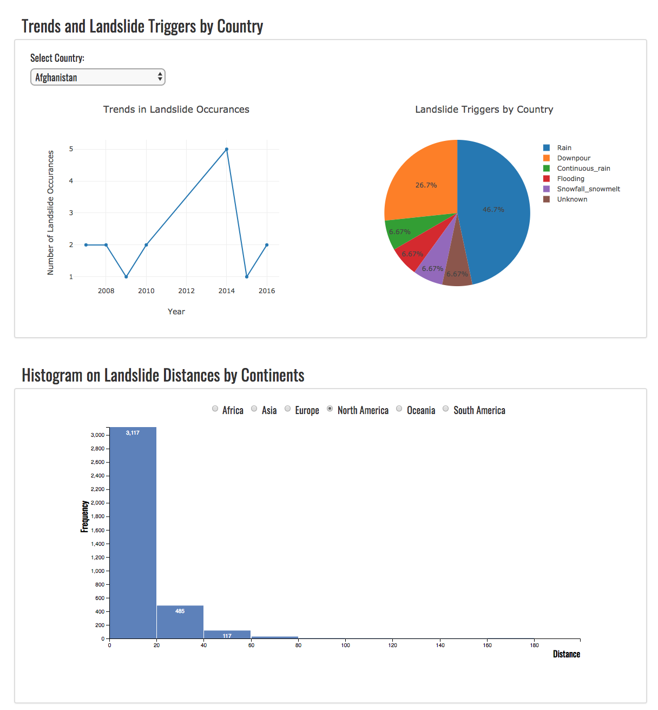

# Landslide Dashboard

### [Live App](https://landslides.herokuapp.com/)

-----

#### Project Team
* [Andrew Price](https://github.com/andrewprice-ut/andrew_repo)
* [Ashley Na](https://github.com/ashleyna94/ashley-na)
* [Antonio Kufoy](https://github.com/akufoy)
* [Asela Dassanayake](https://github.com/asela1982)

-----

#### Project Overview
The goal of this project was to create a JavaScript-based dashboard on landslides based on the the Global Landslide Catalog (GLC). The dataset was extracted from the [NASA's Open Data Portal](https://data.nasa.gov/Earth-Science/Global-Landslide-Catalog-Export/dd9e-wu2v). The dataset was exported once then maintained separately. It is current as of March 7, 2016. The GLC considers all types of mass movements triggered by rainfall, which have been reported in the media, disaster databases, scientific reports, or other sources. The GLC has been compiled since 2007 at NASA Goddard Space Flight Center. 

-----

#### Technologies Used in the Development of the Web Application

* Back End: 
  * Flask
  * Heroku
  * PostgreSQL
  * SQLAlchemy ORM
  * Pandas
  * Python 3.6

* Front End: 
  * HTML/CSS/Bootstrap
  * Javascript
  * JS libraries used for plotting: D3.js, Plotly.js, Leaflet.js, Vis.js

-----

#### Images from the Final Application

-----

#### References
##### Citations
    Kirschbaum, D. B., Adler, R., Hong, Y., Hill, S., & Lerner-Lam, A. (2010). A global landslide catalog for hazard applications: method, results, and limitations. Natural Hazards, 52(3), 561–575. doi:10.1007/s11069-009-9401-4. [1]

    Kirschbaum, D.B., T. Stanley, Y. Zhou (In press, 2015). Spatial and Temporal Analysis of a Global Landslide Catalog. Geomorphology. doi:10.1016/j.geomorph.2015.03.016. [2]
